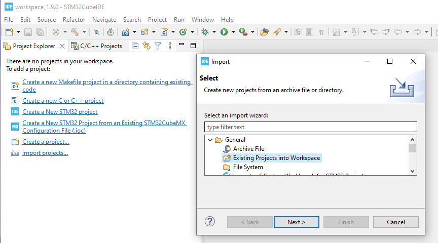
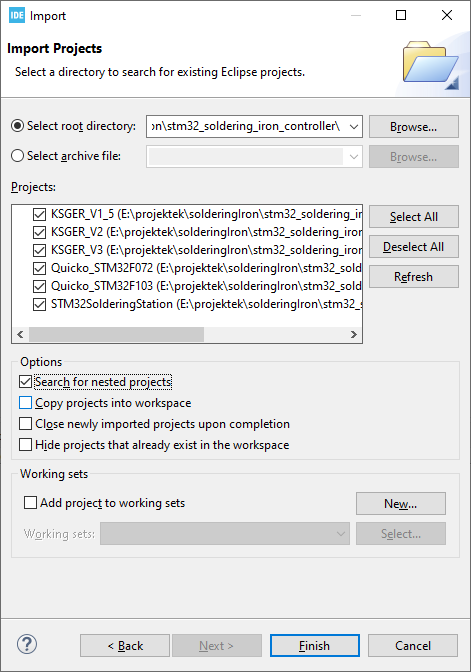
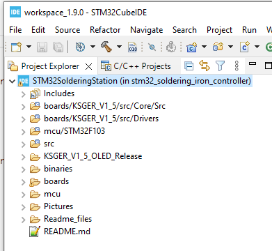
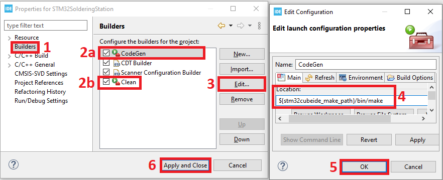
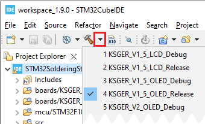
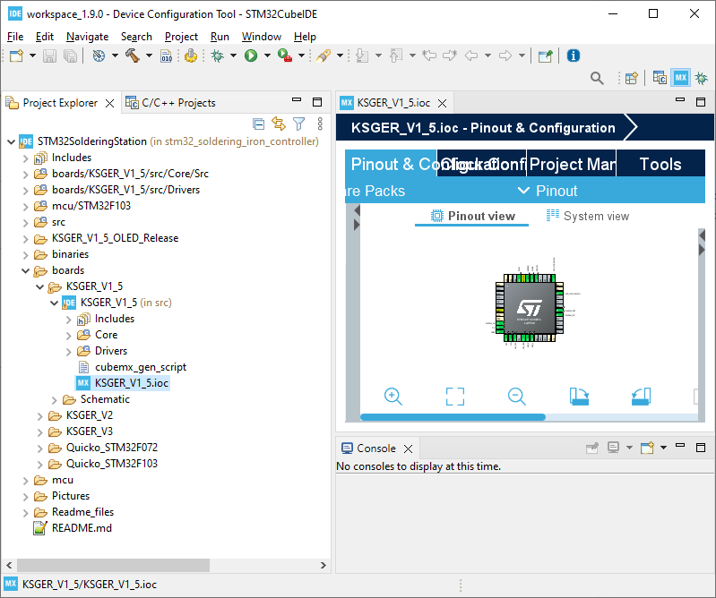

# STM32 Soldering Station Firmware

<!-- MarkdownTOC -->

* [Project details](#Details)
* [Compatibility](#Compatibility)
* [Programming](Readme_files/Programming.md)
* [Operating instructions](Readme_files/Operation.md)
* [Frequently asked questions](#faq)
* [Building the firmware](#build)
* [Translations](#translations)
* [Creating a .ioc file from scratch](Readme_files/Creating_ioc.md)
* [Additional Documentation](#docs)
* [Pending or non working features](#pending)

<!-- /MarkdownTOC -->

 If you liked the firmware, you can send me a beer with [PAYPAL](https://www.paypal.me/davidalfistas) 🙂 

--- 

Video of operation here: (Project in active development, the features will change continuously) 

  

---

## Project details
* This project started by forking [PTDreamer's firmware](https://github.com/PTDreamer/stm32_soldering_iron_controller). Since then it became a separate project.
* Developed on STM32Cube IDE. Basic configuration is easily done in CubeMx (Included in STM32Cube IDE).
* Unified codebase, different hardware support based on profiles, very few files need to be changed.
* Supports all display modes: I2C, SPI, software and hardware+DMA (When connected to hardware pins).
* Uses u8g2 graphics library. 
* Dynamic screen loading to save RAM resources.
* Extremely customizable, lots of options available.
* Code highly optimized to avoid wasting cpu power, slow devices still run great.    

---

## Compatibility

The actual requirements are 10KB RAM and 64KB **(\*)** flash. 
**(\*)** Currently the firmware has surpassed the 64KB limit, and uses the additional undocumented 64KB flash block. 
**(\*)** All 64KB devices have 128KB, with the 2nd 64KB block untested from the factory, so not guaranteed to work. 
**(\*)** To date, I have found zero issues. Original KSGER firmware also does this. 
**(\*)** ST-Link checks the written data, and the firmware uses checksums to protect the settings, any error will be detected. 

**CLONES** Some controllers began to put stm32 clones due the chip shortage. CKS32 works well, but CH32F doesn't! Avoid the CH32F, the ADC makes strange things. 

The [BOARDS](BOARDS) folder has the board code profile, schematics and/or board pictures for quickly identify your hardware. 
Currently supported controllers (Click to download the latest build): 
* [**Quicko T12-072**](BOARDS/Quicko/STM32F072_SSD1306/STM32SolderingStation.bin): For STM32F072 variant.
* [**Quicko T12-103**](BOARDS/Quicko/STM32F103_SSD1306/STM32SolderingStation.bin): For STM32F103 variant.
* [**KSGER v1.5**](BOARDS/KSGER/%5Bv1.5%5D/STM32F103_SSD1306/STM32SolderingStation.bin): Profile for STM32F103 (There are no other known CPUs used in this board).
* [**KSGER v2.x**, **JCD T12**, **T12-955**](BOARDS/KSGER/%5Bv2%5D/STM32F101_SSD1306/STM32SolderingStation.bin): Profile compatible with all STM32F101/2/3xx models.
* [**KSGER v3.x**, **T12-958**](BOARDS/KSGER/%5Bv3%5D/STM32F101_SSD1306/STM32SolderingStation.bin): Profile compatible with all STM32F101/2/3xx models.

For KSGER v2/v3: As long as use the correct firmware, any STM32 variant (101/102/103/C8/R8/CB/RB) will work. 

Actually, the easiest way to quickly identify your KGSER version is by looking at the Oled screen connection: 
- **4 pin** (I2C) = v2.x 
- **6 pin** (SPI) = v3.x 

Also keep in mind that you can't trust the version shown in the original firmware to identify your board. 
Go to [BOARDS](BOARDS)/... schematics folder and compare the pictures. 
There are several compatible/cloned boards in the market that will work fine with Ksger profiles. 

T12-951, T12-952, T12-956, T12-959 use STC mcu, not supported by this firmware. 

---

## Frequently asked questions 

First, make sure to read the [Operating instructions](Readme_files/Operation.md)! 

 
### Changelog 
You can check the [commit history](https://github.com/deividAlfa/stm32_soldering_iron_controller/commits/master) to see what have been changed between builds.

### Backing up the original firmware
The original firmwares are available [[HERE]](Original_FW) 
Some KSGER firmwares require an activation code which can be generated [[HERE]](http://t12.omegahg.com/keygen.htm)  [[Alternative link]](https://rawcdn.githack.com/deividAlfa/stm32_soldering_iron_controller/3f48a9c4c9586f89503ce763b1c6a73b9b73b55a/Original_FW/KSGER/Gen/gen.htm) 

Be warned, usually the MCU will be read-protected, so you won't be able to read its contents, only erase it.  
The simplest way to not loose the original FW is actually to buy a new MCU, replace it, and store the original MCU in a safe place. 
Any difference in the pinout will require firmware tuning, although one of the main proposits of this firmware is easing that. 
There are some hacks / vulnerabilities that can be used to backup protected firmware, more details here: 
**[STM32 power glitching timing attack](https://github.com/dreamcat4/t12-t245-controllers-docs/tree/master/tools/software/STM32CubeIDE#option-2-power-glitching-timing-attack
)** 

### Display issues 
If the display has right/left line like this picture: Go to [System menu](Readme_files/Operation.md#system) / Offset and adjust the value until it's centered. 
 

### Temperature unstability 
By default, never modify any PWM / Delay settings in the [Iron menu](Readme_files/Operation.md#menu). Doing so may cause such issues. 
Also, new tips are often unstable, leading to temperature jumps. 
Don't try to calibrate the tip in this state, neither set a high temperature, because it could go under control. 
They usually settle after some burning time. It's recommended to set a medium temperature (250-300ºC) and leave like that for 15-20 minutes until it stabilizes. 
If the temps are still unstable, try increasing the Iron/Delay option, allowing more time for the temp signal to settle. 
A damaged, loose or defective connection in the handle will also cause this issues. Ensure the contacts are clean. 
There have been problems with some board/stations like: 
* Noisy power supply
* Broken / badly soldered capacitors
* Bad Op-Amp
* Bad 3v3 Regulator

### Temperature accuracy
Buying a cheap high temperature meter is highly recommended! 
These boards can have pretty different readings and tolerances. Even between T12 tips. 
So the factory calibration is intentionally set lower than real, to avoid possible overheating problems. 
Once you set the firmware, go to calibration and set there the real temperature measured with the external probe. 

### Calibration issues 
Ensure to read [Calibration menu](Readme_files/Operation.md#calibration) first!. 
To calibrate, go into Calibration / Start. 
Attach the temperature probe before proceeding! 
If the difference between measured and real is higher than 50ºC, the calibration will be aborted, telling you to go into Calibration / Settings and manually adjust the values. 
The calibration settings menu has 3 calibration steps: Zero set, 250 and 400°C. 
When you edit 250/400ºC value, the power will be enabled and the value applied in real time, so be careful! 
The power will be removed when no settings are being edited. 
Adjust each value until it's close to the target temperature. Repeat for each step and save. 
This values are only used by the calibration process, to prevent burning the tip if your board reads too low. 
After adjusting, repeat calibration, this time it should work correctly. 
The calibration results for the current tip can be seen in the tip settings menu. 
Tip settings menu calibration values aren't meant to be another calibration menu, only for viewing (Ex. reporting calibration results) and for backup/restore purposes. 
In the case you lose, wipe or reset the data, you can go back into that menu and adjust the values based on previous calibration results. 
Zero calibration can't be manually restored, but it only takes few seconds to adjust. 

### Cold tip not showing ambient temperature
Some amplifiers can introduce a small voltage offset that will translate into the cold tip reading 30-50°C higher than ambient temperature. 
To fix that, enter the [Calibration menu](Readme_files/Operation.md#calibration), insert a completely cold tip, enter Settings, adjust Zero set calibration and save. 
After that, the offset will be compensated and the cold temperature will be normal. 
It's highly recommended to recalibrate after changing this value. 

### KSGER self-resetting 
Some KSGER controllers use a linear regulator to convert 24V to 3.3V, which is a very bad design and generates a lot of heat. 
With the oled displays, each pixel turned on consumes more power, and this firmware uses much larger numbers for the display. 
Thus, this firmware uses some more power. The design is so bad that the regulator will overload and shut down, resetting the board. 
There're some options to fix this: 
- Lower the display brightness to reduce the power consumption. 
- Put a 100-150Ω 2W resistor in series with the regulator (24V->Resistor->LDO input). The resistor will drop part of the voltage and reduce the stress on the regulator. 
- Replace the LDO with a better one, or modify the board, adding a LDO that accepts a small heatsink to take away the heat. 
- Use a small DC/DC step-down module to convert 24V to 5V, and feed 5V to the 3.3V LDO (best option, barely makes any heat). 

### Other issues 
After fully reading the documentation, if you still have problems or doubts, please ask in the EEVblog thread: 
https://www.eevblog.com/forum/reviews/stm32-oled-digital-soldering-station-for-t12-handle. 

---

## Building the firmware

To build the firmware follow the steps below:

- Install STM32CubeIDE. The installer can be downloaded from [ST's site](https://www.st.com/en/development-tools/stm32cubeide.html) (registration required). Version 1.9.0 is tested and known to work.
- Clone the repository or download the [current snapshot](archive/refs/heads/master.zip).
- Open STM32CubeIDE and import the project (with one of the following methods):
  - Either in the project explorer tab click on the *Import projects...* or in the *C/C++ Projects* right click and choose *Import*.
  - Select *General/Existing Projects into Workspace*, click *Next*. 
    
  - Select the root directory to where you have cloned/downloaded the repository.
  - The *Search for nested projects* option should be checked (not mandatory but it is recommended). 
    
  - Click *Finish*. Now the project is loaded into your current workspace.
- Select the project by simply clicking on it either in the *Project Explorer*:  
  
- If you are on linux/macos (**skip this step if you are using windows**):
  - Right click on the *STM32SolderingStation* project, select *Properties*.
  - Select the *Builders* on the left side.
  - Click on *CodeGen* builder, then on the right side click *Edit...*.
  - Modify the *Location* to "${stm32cubeide_make_path}/bin/make".
  - Click *Ok* then *Apply and Close*.
  - Repeat this for the *Clean* builder. 
    
- Click on the small down arrow next to the build icon and select the configuration you want to build. Pick the *Release* configuration of your target hardware. 
   
  It may ask you to download libraries, download them. It may take a while to compile the first time. The resulting binaries will be placed into a new folder in the project named after the configuration as a *.bin* file, and also into the *binaries* folder.

## Project structure

The repository contains multiple projects. The main project is the *STM32SolderingStation* containing non hardware specific code. Inside the *boards* folder there is one sub-project for each hardware target.

### Hardware targets

Hardware targets are what tailors the main project to suit the given hardware. Each hardware target has its own project. Don't confuse hardware targets and configurations (explained later)! These projects hold the IOC file which contains the peripheral and driver configurations. The IDE generates code from this, and automatically copies the required dependencies to the project. These hardware projects are not what actually compiles the final binary. 
*Technical note: These projects only exist for convenience reasons. The STM32CubeIDE only allows opening the IOC files if they are placed to the project's root and have the same name as the project itself.*

To edit a hardware configuration, simply open the IOC file and do your modifications to the given board layout. 
 
It is not required to generate the code when saving the IOC file, the code generation will be executed automatically.

To add an entirely new hardware target follow the steps below (and also follow the steps to add a new configuration described in the *main project* section):

- Duplicate one of the folders from the *boards* folder and rename it with the new hardware target's name (don't use spaces in the name, and the name is case sensitive).
- Rename the IOC file (in the src folder) to the same name (case sensitive!) as the board name.
- If you target a new not previously supported controller
  - Add a folder with the controller's name into the *(repository)/mcu* folder with the linker script and the startup file.
  - Add the interrupt handler template to the *(repository)/mcu/templates* folder.
- Add your new board's name (case sensitive!) to the makefile which generates the sources. Open the *(repository)/mcu/generate_sources.makefile* file and add your new target to it:
  - Add "./boards/XXX/src/generated" to the "all" target where XXX is your new board's name
  - Add "clean_XXX" to the "clean" target.
  - Add a new *IT_FILE_XXX* variable with the interrupt handler template filename.

- Optionally if you want to conveniently edit the IOC file (you can also edit directly it via STM32CubeMX)
  - Open the .project file inside your new board's folder with a text editor and change the name of the project to the new board name. Simply replace what's within the *\<name\>* node.
  - Open the .cproject file with a text editor and with find & replace replace all occurrences of the old board name with the new one.
  - If you want to target a different microcontroller than the board what you just copied you have to change it in the cproject file. It is not possible to change this in the IDE, you will have to do this manually in the file. Search and replace for example "STM32F103" with your new controller's name.
  - Import the new project the same way as described in the [build](#build) section.
- Open the *cubemx_gen_script* file in your board folder and change the IOC file name to match your board's name.
- Open the IOC file with a text editor and search and replace the board name there too.
- Make your changes to the IOC file, change the target MCU, etc...

During code generation (when building from the main project) the main.h, main.c, \*_it.c and the startup_\*.s files are taken from the *mcu* folder and the IDE uses those as a template. If one of those files change or the IOC file changes the code generation is re-run automatically during the build. 
The build configurations in the hardware target projects are not used.

The repository does not contain the generated code, nor any ST library. These will be added during code generation. The code generation is automatically invoked via a custom builder from the main project.

### Main project

TODO

### Build configurations in the main project

TODO

At some point, the firmware might not fit into the flash when compiling for debugging, as it'll skip optimizations, and use much more space. 
In that case, you'll need to force some optimization level, starting with "Optimize for debug" (Og), and going to higher levels if still being too big (O1,O2,Osize). 
The settings can be changed in project Properties / Build / Settings / MCU GCC Compiler / Optimizations. 
However, when debugging, it's desirable to completely disable optimizations to see the program flow clearly. 
If you had to enable any level of global optimizations, you can still selectively disable build optimizations for any function. 
A line of code can be found at the start of main.h: 

  __attribute__((optimize("O0")))

Copy that line before a function to disable optimization, like this: 

   __attribute__((optimize("O0"))) void ThisFunctionWillNotBeOptimized(...)
   

If you want to retarget the project, avoid mixing different profile files. 
Run the included script "Clean_Profile.bat", or manually delete these files: 

    /Core/Inc/*stm32*
    /Core/Src/*stm32*
    /Core/Src/system_stm32*
    /Core/Startup/*

And then copy the board profile files overwriting any existing files.  

If you use an existing project template and modify it, the changes must be reflected in /Core/Inc/board.h. 
All the project code takes the data from there. The file it's pretty much self-explaining. 
So, any changes you make in CubeMX, ex. use PWM timer6 intead timer2, or SPI1 instead SPI2...all that should be configured in their respective define. 
As long as the GPIO names are called the same way, no further changes are needed. 
 
---

     
## Translations

For adding new languages, you have to modify these files: 
* Src/settings.h 
  LANGUAGE_COUNT, lang_english,lang_xxxx in system_types enum  
* Drivers/gui/gui_strings.c 
  strings_t strings, Langs[LANGUAGE_COUNT] 

For adding new characters to the existing fonts symbols, there're some instructions here: 
* Drivers/graphics/u8g2/tools/font/bdfconv/Notes.txt 

---
           

### Non working features
* I2C eeprom. Some boards have it, some doesn't. So internal flash storage is used for all. 
Also, the current settings don't fit in the commonly used 24C08 memory. 
* RTC clock. There's very little space in the screen. Use it for what matters, instead for showing a clock!

---

## Additional Documentation

* Dreamcat4 has made a great research and documentation of T12 and STM32 related stuff:
* **[Dreamcat4 documentation repo](https://github.com/dreamcat4/t12-t245-controllers-docs)**
* **[Backup of original PTDreamer Blog](https://github.com/dreamcat4/t12-t245-controllers-docs/tree/master/research/ptdreamer)** 
